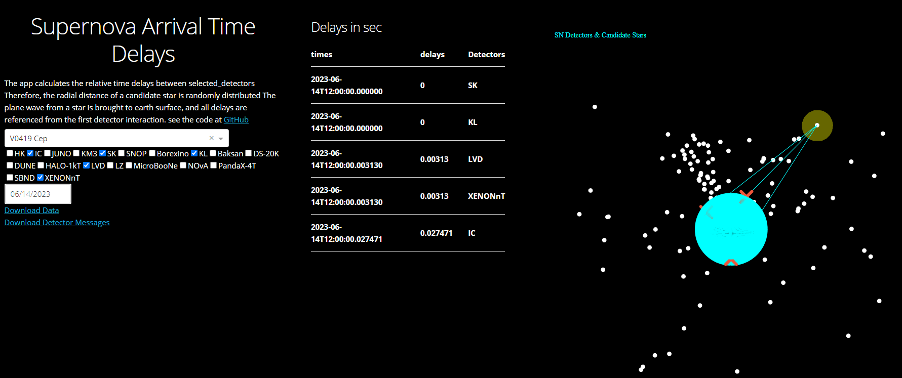

# Supernova reverse-triangulation app

This app calculates the expected time delays between different delays with respect to the selected supernova candidate. The dash app is currently hosted at 
http://kara.pythonanywhere.com/ 

# Ignore Below
## some notes to self, needs to be cleaned

Updated to automatically deploy at
http://supernova-neutrinos.herokuapp.com/

https://git.heroku.com/supernova-neutrinos.git

On local machine to kill it
If you do `sudo netstat -ltnp`, on a Linux type operating system, you will most probably see the process owning the port. Kill it with `kill -9 <pid>`.
